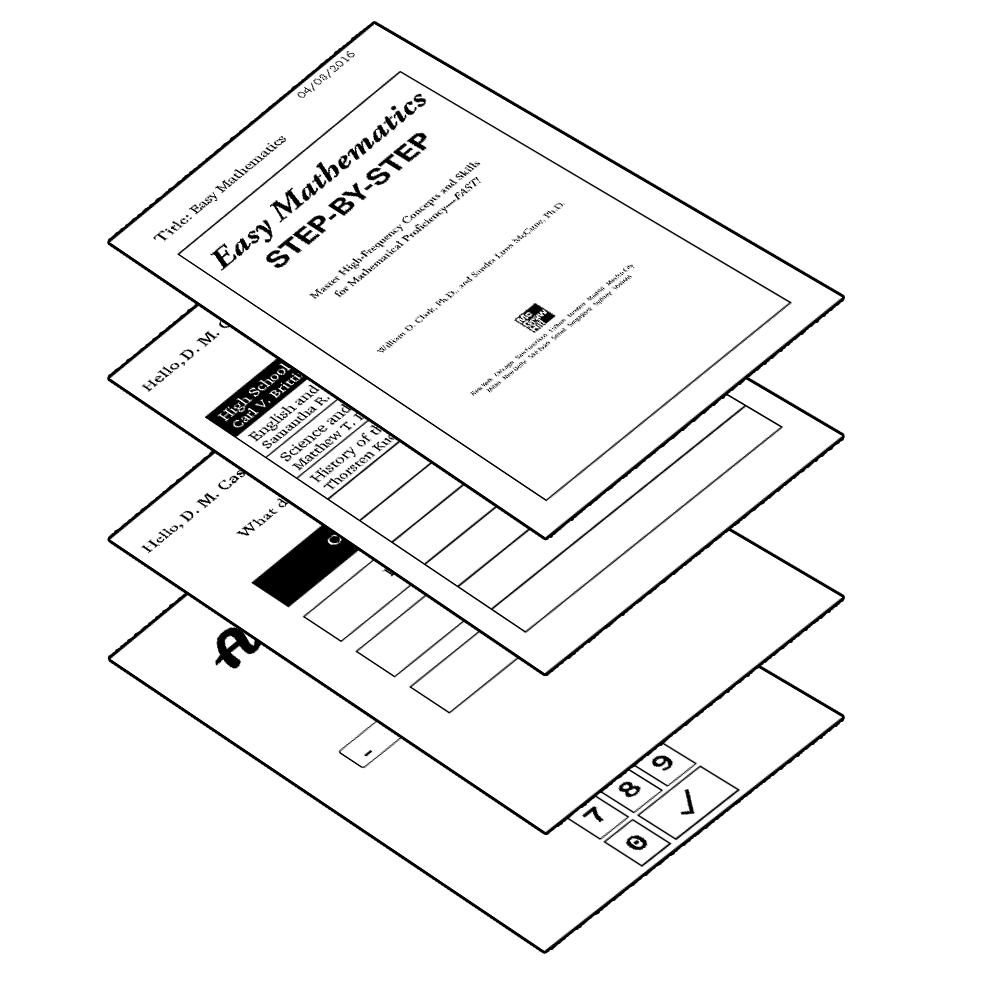

# Development of an Electronic Paper Display E-Reader

## Introduction

This E-Reader device is a Raspberry Pi 2 single board computer with the first generation MpicoSys 7.4” E-Paper Display Kit by Pervasive Displays, Inc. The kit provided included a timing control module(TCM) that was used to control the display and an Aurora SW074AS182 7.4” EPD. In this prototype, the device takes around 6 seconds to refresh the display because the EPD in use does not have a flashless update capability.

To run properly, there must be a Book directory within the project folder which contains EPUB files and the userAccounts.db must have indexed those ebooks with their corresponding users.

## Video Demo

## Raspberry Pi - TCM Pin Configuration

| RPi 2     | TCM     |
| :-------: |:-------:|
| PIN 6     | GND     |
| PIN 12    | /EN     |
| PIN 1     | VDDIN   |
| PIN 2     | VIN     |
| PIN 16    | BUSY    |
| PIN 21    | MISO    |
| PIN 19    | MOSI    |
| PIN 24    | /CS     |
| PIN 23    | SCK     |
| PIN 34    | GND     |

## Dependencies

* Pillow (3.1.0)
* BeautifulSoup4 (4.4.1)
* HTML2Text (2016.1.8)
* lxml (3.6.0)